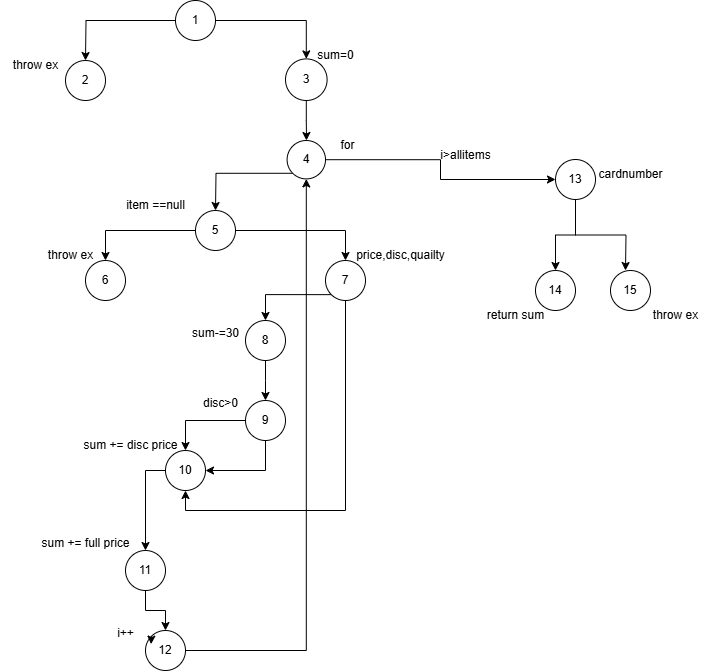

# Лабораториска вежба 2 - Софтверско инженерство 

Ивана Јосифовска,бр. на индекс 223256

2.Control Flow Graph

3.Цикломатска комплексност
 Цикломатската комплексност на овој код е 4, истата ја добив преку формулата P+1, каде што P е бројот на предикатни јазли (условни гранки). Во случајов, кодот има 3 предикатни јазли (3 if услови), па цикломатската комплексност изнесува 4. 

